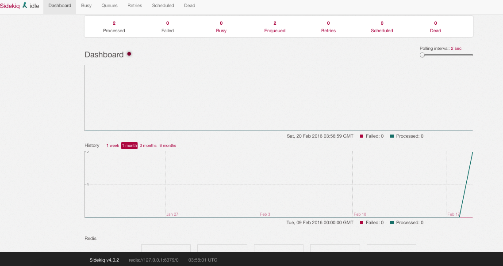

## Table of Contents

* [Active Job](#active-job)
	* [Sidekiq](#sidekiq) 
* [Rspec & Rails](#rspec--rails)
	* [Why Rspec?](#why-rspec) 
	* [Testing Philosophy](#testing-philosophy)
	* [Setting up RSpec](#setting-up-rspec)
	* [Model Specs](#model-specs)
		* [Creating a model spec](#creating-a-model-spec)
		* [Testing non ideal results](#testing-non-ideal-results)
		* [DRYer specs with describe and context](#dryer-specs-with-describe-and-context) 

## Active Job

Almost any modern application has the need for a variety of queueing services: email handling, scheduling newsletters or even database housekeeping tasks, [Active Job](http://edgeguides.rubyonrails.org/active_job_basics.html) can help you with all those tasks and more. The main point of this library is to ensure a job infraestructure for all rails applications, and for that infraestructure to be a place where you can put other gems on top, withouth having to worry about API differences.

Active Job was introduced in Rails 4.2 so you need this or an ealier version of rails. As with everything in rails, there's a generator:

```bash
$ rails g job Mailer
$ create  app/jobs/mailer_job.rb
```

Here's what the file would look like

```ruby
class MailerJob < ActiveJob::Base
  queue_as :default

  def perform(*args)
  end
end
```


So if you want to send an email in a background job, you'll have to do something like this:

```ruby
class MailerJob < ActiveJob::Base
  queue_as :default

  def perform user_id
  	user = User.find(user_id)
  	UserMailer.send_activation_mailer(user).deliver
  end
end
```

Note: 

- You can define `perform` with as many arguments as you want
- It's considered a good practice to use `id`s for your jobs instead of ruby objects, since ruby object information could change between the moment the job is scheduled and the actual moment when the code is executed

And the you can set the job inside your controller/model:


```ruby
MailerJob.perform_later(@user.id)
```


You can also set a different time for the jobs like:

```ruby
MailerJob.set(wait: 1.week.from_now).perform_later(@user.id)
```


### Sidekiq

Like we said ActiveJob can use whichever job runners, so let's use the amazing [sidekiq](http://sidekiq.org). 

First things first, Sidekiq depends on [redis](http://redis.io), so we must install this dependency first. If you are using Mac OS X and Homebrew simply type the following command in your terminal 

```bash
brew install redis
```

You can configure to launch redis when your computer starts with

```bash
$ ln -sfv /usr/local/opt/redis/*.plist ~/Library/LaunchAgents
```

Or can turn it on manually with:

```bash
$ redis-server /usr/local/etc/redis.conf
```

After that we just need to tell our  application that Sidekiq is going to be our multiple queuing backend, and for that lets add the following line inside `config/application.rb` file

```ruby
# config/application.rb
module YourApp
  class Application < Rails::Application
  
    config.active_job.queue_adapter = :sidekiq
  end
end
```

Now as usual we need to add it to our `Gemfile` and run `bundle install`:

```ruby
gem 'sidekiq' 
gem 'sinatra', :require => nil
```

Finally add the following in `config/routes.rb` file:

```ruby
require 'sidekiq/web'
mount Sidekiq::Web => '/sidekiq'
```

And restart your app.

To start sidekiq you need to open another tab in your terminal and run the following command:

```bash
$ bundle exec sidekiq
```

You'll see an output like this:

```bash


         m,
         `$b
    .ss,  $$:         .,d$
    `$$P,d$P'    .,md$P"'
     ,$$$$$bmmd$$$P^'
   .d$$$$$$$$$$P'
   $$^' `"^$$$'       ____  _     _      _    _
   $:     ,$$:       / ___|(_) __| | ___| | _(_) __ _
   `b     :$$        \___ \| |/ _` |/ _ \ |/ / |/ _` |
          $$:         ___) | | (_| |  __/   <| | (_| |
          $$         |____/|_|\__,_|\___|_|\_\_|\__, |
        .d$$                                       |_|

2016-02-20T03:50:25.656Z 48153 TID-oxo1mlzpk INFO: Running in ruby 2.2.1p85 (2015-02-26 revision 49769) [x86_64-darwin14]
2016-02-20T03:50:25.656Z 48153 TID-oxo1mlzpk INFO: See LICENSE and the LGPL-3.0 for licensing details.
2016-02-20T03:50:25.656Z 48153 TID-oxo1mlzpk INFO: Upgrade to Sidekiq Pro for more features and support: http://sidekiq.org
2016-02-20T03:50:25.656Z 48153 TID-oxo1mlzpk INFO: Booting Sidekiq 4.0.2 with redis options {:url=>nil}
```

Now go to `localhost:3000/sidekiq` and watch the awesomeness



To leave sidekiq simply type `ctrl` + `c`

## Rspec & Rails

*Most of this definitions and examples were taken from the great book of [Everyday Rails Testing with Rspec](http://everydayrails.com). by [Aaron Summer](https://twitter.com/ruralocity)*

Rails and automated testing go hand in hand, yet many people developing in Rails are either not testing their projects at all, or at best only adding a few token specs on model validations. Maybe is because writing tests is mostly perceived as time taked away from writing the features our clientes or bosses demand. Or maybe the habit of defining “test” as the practice of clicking links in the browser is just too hard to break. Rails ships with a built-in test framework, so yeah, testing’s pretty important in Rails.

### Why Rspec?

Nothing against the other test frameworks out there, but for whatever reason RSpec is the one that’s stuck with us. Maybe because RSpec’s capacity for specs that are readable, without being cumbersome, is a winner, even most non-technical people can read a spec written in RSpec and understand what's going on. 

### Testing philosophy

Approach on testing philosophy focuses on the following foundation:

- Tests should be reliable.
- Tests should be easy to write
- Tests should be easy to understand 

In the end, though, even if your tests are not quite as optimized as they could be, are a great way to start. This approach allows to take an advantage of a fully automated test suite and using tests to drive development and remove potential bugs and edge cases.

### Setting up Rspec

We need to configure our rails applications to recognize and use RSpec and to start generating the appropriate specs  whenever we employ a Rails generator to add code to the application. 

#### Gemfile

Since RSpec isn’t included in a default Rails application, we’ll need to install it by adding it to our Gemfile and running `bundle install` after that

```ruby
group :development, :test do
  gem "rspec-rails" 
  gem "factory_girl_rails" 
end

group :test do
  gem "faker"
  gem "capybara" 
  gem "database_cleaner" 
  gem 'rspec-collection_matchers'
  gem "capybara-selenium"
  gem "selenium-webdriver", "2.53.4"
end
```

But hey why do we install it in two separate groups?

`rspec-rails` and `factory_girl_rails` are used in both the development and test environments. Specifically, they are used in development by generators we’ll be utilizing shortly. The remaining gems are only used when you actually run your specs, so they’re not necessary to load in
development. 

What we just install?

- [rspec-rails](https://github.com/rspec/rspec-rails) includes RSpec itself
- [rspec-collection-matchers](https://github.com/rspec/rspec-collection_matchers) lets you expressed expected outcomes on collection objects or an object itself
- [factory girl rails](https://github.com/thoughtbot/factory_girl_rails) replaces fixtures for feeding test data to the test suite with much more preferable factories.
- [faker](https://github.com/stympy/faker) generates random data like names, email addresses, etc.
- [capybara](https://github.com/jnicklas/capybara) makes it easy to programatically simulate your user's interactions with your application.
- [database_cleaner](https://github.com/DatabaseCleaner/database_cleaner) helps make sure each spec run in RSpec begins with a clean slate.

#### Database configuration

Wait, what? Yup tests have its own database. Open `config/database.yml` file to see which databases your application is ready to talk to. If you haven’t made any changes to the file, you should see something like the following:

```ruby
default: &default
  adapter: sqlite3
  pool: 5
  timeout: 5000

development:
  <<: *default
  database: db/development.sqlite3

test:
  <<: *default
  database: db/test.sqlite3

production:
  <<: *default
  database: db/production.sqlite3
```

You see the `test` section? That is where we configure our test database. To ensure there’s a database to talk to, run the following rake task:

```bash
$ rake db:create:all
```

Or simply create a database for our test env

```bash
$ RAILS_ENV=test rake db:create
```

After that, just as development,  you'll need to run migrations

```bash
$ RAILS_ENV=test rake db:migrate
```

Now you do have a test database!

#### Rspec itself

Install RSpec into the application with the following command line directive:

```bash
$ rails g rspec:install
create  .rspec
create  spec
create  spec/rails_helper.rb
create  spec/spec_helper.rb
```

As the generator reports, we’ve now got:

- a configuration file for RSpec (`.rspec`)
- a directory for our spec files as we create them (spec)
- and two helper files where we’ll further customize how RSpec will interact with our rails app(`spec/spec_helper.rb` & `spec/rails_helper.rb`).

In prior versions to Rspec 3, only a single `spec_helper.rb` file was generated. This file has been moved to `rails_helper.rb`. This change was made to accomplish two general goals:

- Keep the installation process in sync with regular RSpec changes

- Provide an out-of-the-box way to avoid loading Rails for those specs that do not require it

Next and this is optional, but really recommended, change RSpec’s output from the default format to the easy to read documentation format, open .rspec and add the following line:

```
--format documentation
--color
```

This makes it easier to see which specs are passing and which are failing as your suite runs; it also provides an attractive outline of your specs for documentation purposes

### Model specs

It's easiest to learn testing at the model level because doing so allows you to examine and test the core building blocks of an application. Well-tested code at this level is solid foundation and the first step toward a reliable overall code base.

To get started, a model spec should include tests for the following:

- The model's create method, when passed valid attributes, should be valid
- Data that failed validations should not be valid
- Class and instance methods perform as expected

#### Creating a model spec

Suppose we need a `Contact` model with the following requirements: 

- It should have a first name, last name and email
- It will be invalid without any of the former attributes
- It will be invalid with a duplicate email address
- We'll need to provide a way to display the full name

This give us quite a bit for start, we can easly translate this requirements into our own model spec

First open up the `spec` directory and if necessary, create a subdirectory named `models`, finally inside this subdirectory create a file named `contact_spec`

```ruby
# spec/models/contact_spec.rb
require 'rails_helper'

describe Contact do
  it "is valid with a firstname, lastname and email"
  it "is invalid without a firstname"
  it "is invalid without a lastname"
  it "is invalid without an email address"
  it "is invalid with a duplicate email address"
  it "returns a contact's full name as a string"
end
```

Did you see the `require 'rails_helper'` at the top of the file? Well get ready to typing it across all of your specs. 

In the former file take notice that: 

- Each example (a line beginning with `it`) only expects one thing
- Also each "it" describe a set of expectations of what a `Contact` should look like. It is really explicit!
- The descriptive after `it`is technically optional in Rspec, however omitting it makes your specs more difficult to read
- **Each example descriptions begins with a verb**. Try to read the expectations out loud: *Contact is valid with a firstname, last name and email, Contact is invalid without a firstname* and so on. **Readibility as you see is really important**

Now simply create a model `Contact` inside app/models like:

```ruby
class Contact < ActiveRecord::Base
end
```

If we ran the specs right now from the command line, we'll obtain an output like the following:

```bash
$ rspec
Contact
  is valid with a firstname, lastname and email (PENDING:
Not yet implemented)
  is invalid without an email address (PENDING: Not yet implemented)
  returns a contact's full name as a string (PENDING:
Not yet implemented)
  is invalid with a duplicate email address (PENDING:
Not yet implemented)
  is invalid without a firstname (PENDING: Not yet implemented)
  is invalid without a lastname (PENDING: Not yet implemented)

Pending:
Contact is valid with a firstname, lastname and email
# Not yet implemented
# ./spec/models/contact_spec.rb:4
Contact is invalid without an email address
# Not yet implemented
# ./spec/models/contact_spec.rb:7
Contact returns a contact's full name as a string
# Not yet implemented
# ./spec/models/contact_spec.rb:9
Contact is invalid with a duplicate email address
# Not yet implemented
# ./spec/models/contact_spec.rb:8
Contact is invalid without a firstname
# Not yet implemented
# ./spec/models/contact_spec.rb:5
Contact is invalid without a lastname
# Not yet implemented
# ./spec/models/contact_spec.rb:6

Finished in 0.00098 seconds
6 examples, 0 failures, 6 pending
```

Which basically states that we have six pending specs, let's start with the first one

```ruby
it "is valid with a firstname, lastname and email" do
  contact = Contact.new(firstname: 'Cosme', lastname: 'Fulanito', email: 'cosme_fulanito@hackerschool.com')
  expect(contact).to be_valid
end
```

And modified the model to meet our expectations

```ruby
class Contact < ActiveRecord::Base
  validates :firstname, presence: true
  validates :lastname, presence: true
  validates :email, presence: true
end
```

This simple example uses RSpec's `be_valid` matcher to verify that our model knows what it has to look like to be valid. If we run rspec again, we'll see one passing example. Let's go ahead and complete the next spec 

```ruby
it "is invalid without a firstname" do
  expect(Contact.new(firstname: nil)).to have(1).errors_on(:firstname)
end
```

Notice that we're **expecting that the new contact (with a firstname explicitly set to nil) will not be valid, by returning an error on the contact's firstname attribute**. Given the validations inside our `Contact` model if we run rspec again we should be up two passing specs. Let's copy the same behaviour for spec 3 & 4

```ruby
it "is invalid without a lastname" do
  expect(Contact.new(lastname: nil)).to have(1).errors_on(:lastname)
end
  
it "is invalid without an email" do
  expect(Contact.new(email: nil)).to have(1).errors_on(:email)
end 
```

If we run rspec again we should see four of our specs passing! yeih! ... Testing email address uniqueness should be fairly simple as well:

```ruby  
  it "is invalid with a duplicate email address" do
    Contact.create(firstname: 'Cosme', lastname: 'Fulanito', email: 'cosme_fulanito@hackerschool.com')
    contact = Contact.new( firstname: 'Abraham', lastname: 'Cosme', email: 'cosme_fulanito@hackerschool.com')
    expect(contact).to have(1).errors_on(:email)
  end
end  
```

There's a subtle difference in the last example: We use `create` instead of `new`, so we persisted a contact, why? Becase the spec requires an email contact to compare to, so by saving a contact with an email, we can ensure there's information to run against it. If we modify our model accordingly:

```ruby
class Contact < ActiveRecord::Base
  validates :firstname, presence: true
  validates :lastname, presence: true
  validates :email, presence: true, uniqueness: true
end
```

And then run rspec again, we'll have 5 of our 6 specs passing! Nice! 

Let's finish this up by completing the last spec:

```ruby
it "returns a contact's full name as a string" do
  contact = Contact.new(firstname: 'Cosme', lastname:'Fulanito', email: 'cosme_fulanito@email.com')
  expect(contact.name).to eq 'Cosme Fulanito'
end
```

And adding the regarding code into our `Contact` model

```ruby
class Contact < ActiveRecord::Base
  validates :firstname, presence: true
  validates :lastname, presence: true
  validates :email, presence: true, uniqueness: true
  
  def name
    [firstname, lastname].join(' ')
  end
end
```

This is the complete `contact_spec` content:

```ruby
require 'rails_helper'

describe Contact do
  it "is valid with a firstname, lastname and email" do
    contact = Contact.new(firstname: 'Cosme', lastname: 'Fulanito', email: 'cosme_fulanito@hackerschool.com')
    expect(contact).to be_valid
  end
  
  it "is invalid without a firstname" do
    expect(Contact.new(firstname: nil)).to have(1).errors_on(:firstname)
  end
  
  it "is invalid without a lastname" do
    expect(Contact.new(lastname: nil)).to have(1).errors_on(:lastname)
  end
  
  it "is invalid without an email" do
    expect(Contact.new(email: nil)).to have(1).errors_on(:email)
  end
  
  it "is invalid with a duplicate email address" do
    Contact.create(firstname: 'Cosme', lastname: 'Fulanito', email: 'cosme_fulanito@hackerschool.com')
    contact = Contact.new( firstname: 'Abraham', lastname: 'Cosme', email: 'cosme_fulanito@hackerschool.com')
    expect(contact).to have(1).errors_on(:email)
  end
  
  it "returns a contact's full name as a string" do
    contact = Contact.new(firstname: 'Cosme', lastname:'Fulanito', email: 'cosme_fulanito@email.com')
    expect(contact.name).to eq 'Cosme Fulanito'
  end
end 
```

If we run rspec we should see all of our specs passing! 

```bash
$ rspec
Contact
  returns a contact's full name as a string
  is invalid without a firstname
  is invalid with a duplicate email address
  is invalid without a lastname
  is valid with a firstname, lastname and email
  is invalid without an email address

Finished in 0.44718 seconds
6 examples, 0 failures
```

Awesome! 

#### Testing non ideal results

Lets complicate things a bit, we now got a new requirement (**damn you client!**): 

- The user must have the ability to make a search for a contact based on a given letter.

This action will also need the controller, but for know lets just keep focus on the model, so lets write the corresponding spec for this (*earlier specs will be omitted for reading purposes*) 

```ruby
require 'rails_helper'

describe Contact do
  ... 
  # Earlier specs
  ...
  it "returns a sorted array of results that match" do
  	cosme = Contact.create(firstname: 'Cosme', lastname: 'Fulanito', email: 'cosme@hackerschool.com')
  	jones = Contact.create(firstname: 'Tim', lastname: 'Jones', email: 'jones@hackerschool.com')
  	johnson = Contact.create(firstname: 'John', lastname: 'Johnson', email: 'johnson@hackerschool.com')
   
   expect(Contact.by_letter("J")).to eq [johnson, jones] 
  end
end  
```

Let's incorpore the method `by_letter` into our `Contact` model that fulfills the spec:

```ruby
class Contact < ActiveRecord::Base
  validates :firstname, presence: true
  validates :lastname, presence: true
  validates :email, presence: true, uniqueness: true
  
  def name
    [firstname, lastname].join(' ')
  end
  
  def self.by_letter(letter)
    where("lastname LIKE ?", "%#{letter}%").order(:lastname)
  end
end
```

Great! But there's a small problem we have only test for the *happy path*, we must also test for another not so happy endings, lets do that:

```ruby
require 'rails_helper'

describe Contact do
  ... 
  
  it "returns a sorted array of results that match" do
  	cosme = Contact.create(firstname: 'Cosme', lastname: 'Fulanito', email: 'cosme@hackerschool.com')
  	jones = Contact.create(firstname: 'Tim', lastname: 'Jones', email: 'jones@hackerschool.com')
  	johnson = Contact.create(firstname: 'John', lastname: 'Johnson', email: 'johnson@hackerschool.com')
   
   expect(Contact.by_letter("J")).to eq [johnson, jones] 
  end
  
  it "returns only results that match" do
  	cosme = Contact.create(firstname: 'Cosme', lastname: 'Fulanito', email: 'cosme@hackerschool.com')
  	jones = Contact.create(firstname: 'Tim', lastname: 'Jones', email: 'jones@hackerschool.com')
  	johnson = Contact.create(firstname: 'John', lastname: 'Johnson', email: 'johnson@hackerschool.com')
   
   expect(Contact.by_letter("J")).to_not include cosme
  end
end  
```

Now we are also testing the other side of the coin: We're verifying that `by_letter`method returns the expecting results and to not return those contacts whose name doesn't match with the letter

#### DRYer specs with describe and context

Just as in our rails application, **the DRY principles also applies to our tests**, and if we check our two latest specs we can see that there's a lot of duplicated code. Let's use another rspec feacture to clean this up

```ruby
require 'rails_helper'

describe Contact do
  ... 
  describe "filter last name by letter" do
    before(:each) do
      @cosme = Contact.create(firstname: 'Cosme', lastname: 'Fulanito', email: 'cosme@hackerschool.com')
  	  @jones = Contact.create(firstname: 'Tim', lastname: 'Jones', email: 'jones@hackerschool.com')
  	  @johnson = Contact.create(firstname: 'John', lastname: 'Johnson', email: 'johnson@hackerschool.com')
    end
    
    it "returns a sorted array of results that match" do
      expect(Contact.by_letter("J")).to eq [@johnson, @jones]
    end
    
    it "returns a sorted array of results that match" do
      expect(Contact.by_letter("J")).to_not include @cosme
    end
  end
end
```

Notice that:

- We're using a `describe` block within the `describe Contact` block to help us sort similar examples together.
- We're also using a `before` hook, which is vital to clean up our nasty redundancy. As you might have guess the code inside our `before` block is run before `each` example 

Let's break things down even further by including a couple of `context` blocks one for matching letters and one for non-matching


```ruby
require 'rails_helper' describe Contact do
  ... 
  describe "filter last name by letter" do
    before(:each) do
      @cosme = Contact.create(firstname: 'Cosme', lastname: 'Fulanito', email: 'cosme@hackerschool.com')
  	  @jones = Contact.create(firstname: 'Tim', lastname: 'Jones', email: 'jones@hackerschool.com')
  	  @johnson = Contact.create(firstname: 'John', lastname: 'Johnson', email: 'johnson@hackerschool.com')
    end
    
    context "matching letters" do
     it "returns a sorted array of results that match" do
       expect(Contact.by_letter("J")).to eq [@johnson, @jones]
     end
    end
    
    context "non-matching letters" do
      it "returns a sorted array of results that match" do
        expect(Contact.by_letter("J")).to_not include @cosme
      end
    end
  end
end
```

While `describe` and `context` are technically interchangeable, **its considered a good practice to use `describe` to outline general functionality and `context` to outline specific state.** When we run the specs we'll see a nice outline like this

```bash
Contact
  returns a contact's full name as a string
  is invalid without a firstname
  is invalid with a duplicate email address
  is invalid without a lastname
  is valid with a firstname, lastname and email
  is invalid without an email address
  filter last name by letter
    matching letters
      returns a sorted array of results that match
    non-matching letters
      returns a sorted array of results that match

Finished in 0.44718 seconds
8 examples, 0 failures
```


